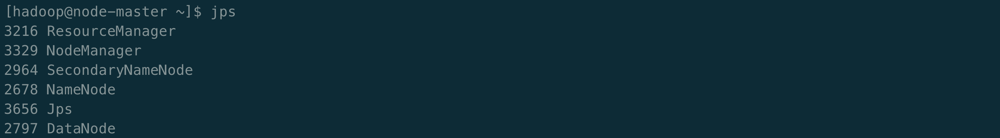
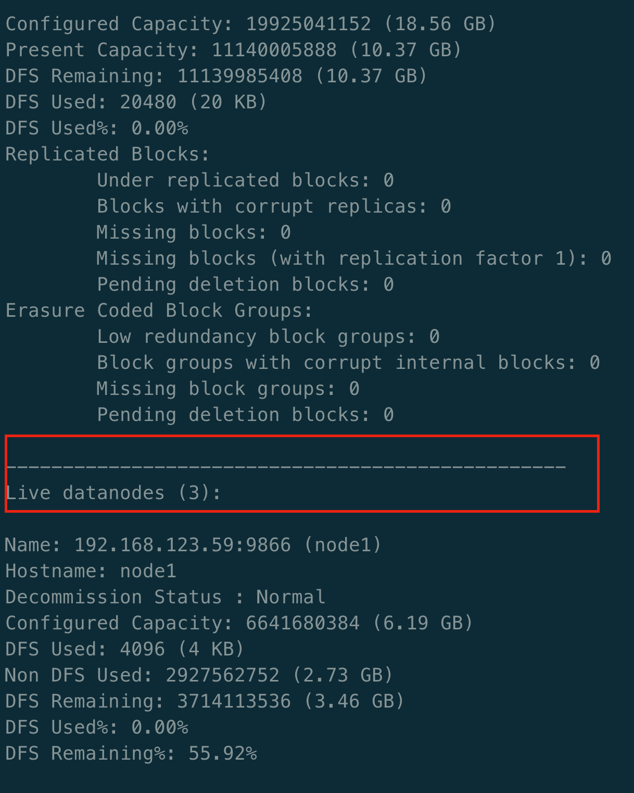
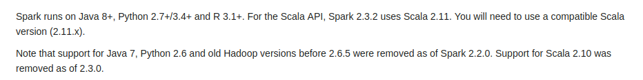
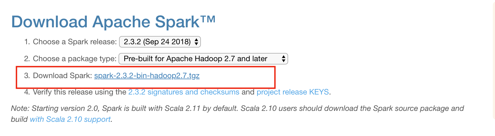
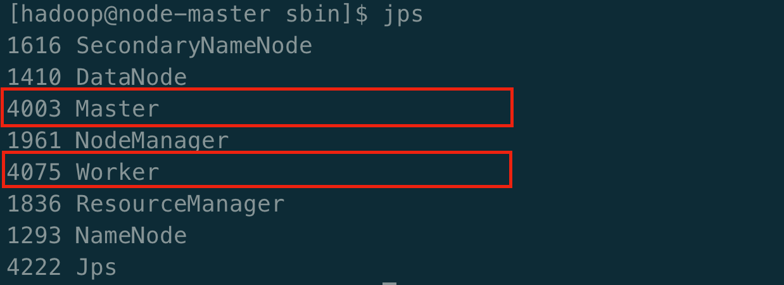
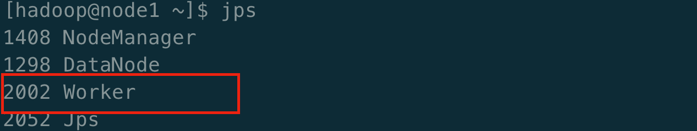

# Spark集群搭建

**说明** `centos7中运行hadoop的用户不要为root账户`	

安装好多台虚拟机后先开启 `ssh-server` 并配置网络服务。

 ```shell
# 先开启管理员权限
su
# =// 输入密码

cd /etc/ssh
vi sshd_config
# 去掉Port、ListenAddress、PermitRootLogin、PasswordAuthentication前的 # 符号
   
# 开启sshd服务
service sshd start
# 检查sshd服务是否已经开启
ps -e | grep sshd
# 查看22号端口是否开启监听
netstat -an | grep 22

# 开机自启动ssh-server
systemctl enable sshd.service
# 查看是否开启了sshd服务自启动
systemctl list-unit-files | grep sshd

# 编辑hosts列表
vi /etc/hosts

# 添加如下内容，下面的IP地址请按照自己的实际情况进行改写
192.168.123.81  node-master
192.168.123.59  node1
192.168.123.75  node2

# 修改服务器的主机名:HOSTNAME
vi /etc/sysconfig/network
# 修改HOSTNAME，根据自己是master还是slave来定
HOSTNAME=node-master

# 重启网络以生效
/etc/init.d/network restart

# 推出管理员权限
exit
 ```

<hr>

前往[Spark的下载页面](https://spark.apache.org/downloads.html)查看spark的版本和所需要的Hadoop以及scala的版本。

1. 配置java环境

   1. rpm方式

      * 下载[java8的rpm包](https://www.oracle.com/technetwork/java/javase/downloads/jdk8-downloads-2133151.html)

         * 导入rpm包到centos7中

           ```shell
           scp jdk-8u191-linux-x64.rpm root@192.168.123.62:/root
           ```

         * 安装jdk

           ```shell
           rpm -ivh jdk-8u191-linux-x64.rpm
           ```

         * 设置环境变量

           ```shell
           # 查看jdk安装的位置
           update-alternatives --display java
           
           # 编辑/etc/profile文件
           vi .bashrc 
           
           # 末尾添加jdk的信息
           # set java environment
           export PATH=/usr/java/jdk1.8.0_191-amd64/bin:$PATH
           
           # 使配置文件生效
           source .bashrc
           
           # 查看java的版本
           java -version
           ```

   2. tar.gz包的方式

       * 下载[java8的tar.gz包](https://www.oracle.com/technetwork/java/javase/downloads/jdk8-downloads-2133151.html)

           * 上传tar.gz包

             ```shell
             scp jdk-8u191-linux-x64.tar.gz hadoop@192.168.123.79:/home/hadoop
             ```

           * 解压tar.gz包

             ```shell
             tar zxvf jdk-8u191-linux-x64.tar.gz 
             mv jdk1.8.0_191 jdk
             ```

           * 设置环境变量

             ```shell
             # 编辑/etc/profile文件
             vi .bashrc 
                      
             # 末尾添加jdk的信息
             # set java environment
             export PATH=/home/hadoop/jdk/bin:$PATH
                      
             # 使配置文件生效
             source .bashrc
                      
             # 查看java的版本
             java -version
             ```

2. 配置SSH

   * 配置免密码登陆本机

      ```shell
        # 生成ssh-key
        ssh-keygen -b 4096
        
        # 将公钥追加到authorized_keys问爱你中
        cat .ssh/id_rsa.pub >> .ssh/authorized_keys
        
        # 赋予权限
        chmod 600 .ssh/authorized_keys
        
        # 验证本机能无密码访问
        ssh node-master	
      ```

   * 配置master免密码登陆slaves

     ```shell
     ssh-copy-id -i $HOME/.ssh/id_rsa.pub hadoop@node-master
     ssh-copy-id -i $HOME/.ssh/id_rsa.pub hadoop@node1
     ssh-copy-id -i $HOME/.ssh/id_rsa.pub hadoop@node2
     ```

   * 配置slaves免密码登陆master

     ```shell
     # 先登录slave的虚拟机，并生成相应的SSH然后执行一下操作
     ssh-copy-id -i $HOME/.ssh/id_rsa.pub hadoop@node-master
     ```

3. 关闭服务器的防火墙

   * 因为centos默认使用 `firewall`做为防火墙，所以需要使用 `iptables` 重设

     ```shell
     # 停止firewall
     systemctl stop firewalld.service
     
     # 禁止firewall开机启动
     systemctl disable firewalld.service
     
     # 下载iptables
     yum -y install iptables-services
     
     # 关闭防火墙
     service iptables stop
     chkconfig iptables off
     
     # 查看防火墙状态
     service iptables status
     
     # 关闭SELINUX
     vi /etc/sysconfig/selinux
     # 注释掉
     SELINUX=enforcing
     SELINUXTYPE=targeted
     # 添加
     SELINUX=disabled
     ```

     最后重启服务器即可。

4. 配置Hadoop集群

   * 下载Hadoop

     前往[Hadoop官网](https://hadoop.apache.org/releases.html)下载最新稳定的发行版。

     ```shell
     # 拷贝压缩包到centos
     scp hadoop-3.1.1.tar.gz hadoop@192.168.123.81:/home/hadoop 
     mv hadoop-3.1.1 hadoop
     ```

   * 配置Hadoop

     ```shell
     # 设置hadoop的环境变量
     vi .bashrc
     export PATH=/home/hadoop/hadoop/bin:/home/hadoop/hadoop/sbin:$PATH
     source .bashrc
     
     # 转到hadoop配置文件目录
     cd /home/hadoop/hadoop/etc/hadoop
     ```

     填写具体的配置信息

     ```shell
     # 配置hadoop启动文件
     vi hadoop-env.sh
     # 去掉export JAVA_HOME=前面的 #，并设置JAVA_HOME的实际位置
     export JAVA_HOME=/home/hadoop/jdk/jre
     # 在文件最后添加用户，其中hadoop为执行hadoop命令的用户名，请自行修改
     export HDFS_NAMENODE_USER=hadoop
     export HDFS_DATANODE_USER=hadoop
     export HDFS_SECONDARYNAMENODE_USER=hadoop
     export YARN_RESOURCEMANAGER_USER=hadoop
     export YARN_NODEMANAGER_USER=hadoop
     # 保存退出
     
     # 配置nameNode
     vi core-site.xml
     # <configuration></configuration>中添加
     <property>
     	<name>hadoop.tmp.dir</name>
     	<value>file:/home/hadoop/tmp</value>
     </property>
     <property>
     	<name>fs.default.name</name>
     	<value>hdfs://node-master:9000</value>
     </property>
     #保存退出
     
     # 配置hdfs的路径
     vi hdfs-site.conf
     # <configuration></configuration>中添加
     <property>
     	<name>dfs.namenode.name.dir</name>
     	<value>/home/hadoop/nameNode</value> # 注意路径 /home/hadoop/nameNode 可以替换为自己定义的
     </property>
     
     <property>
     	<name>dfs.datanode.data.dir</name>
     	<value>/home/hadoop/dataNode</value> # 注意路径 /home/hadoop/dataNode 可以替换为自己定义的
     </property>
     
     <property>
     	<name>dfs.replication</name>
     	<value>2</value>
     </property>
     
     # 配置YARN做为作业调度器
     vi mapred-site.xml
     # <configuration></configuration>中添加
     <property>
     	<name>mapreduce.framework.name</name>
     	<value>yarn</value>
     </property>
     <property>
     	<name>mapreduce.job.tracker</name>
     	<value>http://node-master:9001</value>
     </property>
     <property>
     	<name>mapreduce.application.classpath</name> 								<value>/home/hadoop/hadoop/share/hadoop/mapreduce/*,/home/hadoop/hadoop/share/hadoop/mapreduce/lib/*,/home/hadoop/hadoop/share/hadoop/common/*,/home/hadoop/hadoop/share/hadoop/common/lib/*,/home/hadoop/hadoop/share/hadoop/yarn/*,/home/hadoop/hadoop/share/hadoop/yarn/lib/*,/home/hadoop/hadoop/share/hadoop/hdfs/*,/home/hadoop/hadoop/share/hadoop/hdfs/lib/*</value>
     </property>
     
     # 配置YARN
     vi yarn-site.xml
     # <configuration></configuration>中添加
     <property>
     	<name>yarn.resourcemanager.hostname</name>
     	<value>node-master</value>
     </property>
     <property>
     	<name>yarn.nodemanager.aux-services</name>
     	<value>mapreduce_shuffle</value>
     </property>
     <property>
         <name>yarn.nodemanager.pmem-check-enabled</name>
         <value>false</value>
     </property>
     <property>
         <name>yarn.nodemanager.vmem-check-enabled</name>
         <value>false</value>
     </property>
     
     # 配置Slaves
     vi workers
     # 改为
     node-master
     node1
     node2
     ```

   * 把上述文件复制到所有的slaves虚拟机中

     ```shell
     # 在master虚拟机中传递相关文件到slaves虚拟机中
     for node in node1 node2; do 
     	scp hadoop-3.1.1.tar.gz $node:/home/hadoop/; 
     	scp jdk-8u191-linux-x64.tar.gz $node:/home/hadoop/; 
     done
     
     # 在slave虚拟机中安装好java和hadoop运行环境
     for node in node1 node2; do scp .bashrc $node:/home/hadoop; done
     
     # 在master虚拟机中传递配置文件
     for node in node1 node2; do 
     	scp hadoop/etc/hadoop/* $node:/home/hadoop/hadoop/etc/hadoop; 
     done
     ```

   4. 启动集群

      1. 格式化HDFS文件系统

         ```shell
         hadoop namenode -format
         ```

      2. 启动hadoop

         ```shell
         start-all.sh
         ```

      3. 使用jps查看运行情况

         * master启动成功

           

         * slave启动成功

           

      4. 命令查看Hadoop集群的状态

         ```shell
          hadoop dfsadmin -report
         ```

         

      5. web页面查看集群运行状况

         ```shell
         # 访问hdfs运行管理界面(ip地址为node-master的地址)
         http://192.168.123.81:9870/
         
         # 访问yarn节点运行状况(ip地址为node-master的地址)
         http://192.168.123.81:8088/
         ```

      6. 运行命令查看`hadoop`集群是否搭建成功

         ```shell
         # 在本机执行一下命令，并随便填一些数据
         vi 1.txt
         
         # 上传数据到hdfs中
         hdfs dfs -put ./*.txt books
         ```

         上述要是没有打印任何信息则代表`hadoop`集群启动成功

      7. 运行命令查看`yarn`是否搭建成功

         ```shell
         yarn jar hadoop/share/hadoop/mapreduce/hadoop-mapreduce-examples-3.1.1.jar wordcount "books/*" output
         ```

         

         查看命令行是否有这些语句打印，有打印则代表yarn配置成功，可以试用一下命令查看运行结果。

         ```shell
         # 查看当前目录下的文件夹(hdfs)
         hdfs dfs -ls
         
         # 查看output文件夹的内容
         hdfs dfs -ls output
         
         # 查看mapReduce运行的结果
         hdfs dfs -cat output/part-r-00000
         ```

5. 配置Spark集群

   1. 配置scala

      配置scala前需要知道对应的[spark适应的scala版本](https://spark.apache.org/docs/latest/)。

      

      - 下载scala

      - 导入到centos中

        ```shell
        scp scala-2.11.12.tgz hadoop@192.168.123.81:/home/hadoop 
        
        # 解压scala压缩包
        tar zxvf scala-2.11.12.tgz
        mv scala-2.11.12 scala
        ```

      - 配置scala

        ```shell
        vi .bashrc
        
        # 添加环境变量
        export PATH=/home/hadoop/scala/bin:$PATH
        
        # 生效更改
        source .bashrc
        
        # 查看scala版本
        scala -version
        ```

   2. 下载[spark](https://spark.apache.org/downloads.html)

      

   3. 配置Spark集群

      * 下载spark

        ```shell
        # 拷贝到服务器
        scp spark-2.3.2-bin-hadoop2.7.tgz hadoop@192.168.123.81:/home/hadoop
              
        # 解压spark压缩包
        tar zxvf spark-2.3.2-bin-hadoop2.7.tgz
        mv spark-2.3.2-bin-hadoop2.7 spark
        ```

      * 配置spark

        ```shell
        # 编辑.bashrc配置文件
        vi .bashrc
        
        # 添加spark的环境变量
        export PATH=/home/hadoop/spark/bin:$PATH
        
        # 使得修改生效
        source .bashrc
        ```

      * Spark和Hadoop集群配合

        ```shell
        # 转到spark配置文件目录下
        cd /home/hadoop/spark/conf/
        
        # 配置spark-env.sh文件
        cp spark-env.sh.template spark-env.sh
        vi spark-env.sh
        # 添加如下内容
        export HADOOP_CONF_DIR=/home/hadoop/hadoop/etc/hadoop
        export JAVA_HOME=/home/hadoop/jdk
        export SPARK_MASTER_HOST=node-master
        export LD_LIBRARY_PATH=/home/hadoop/hadoop/lib/native:$LD_LIBRARY_PATH
        
        # 在hdfs中导入spark运行所需的所有jar包
        hdfs dfs -mkdir spark
        hdfs dfs -put spark/jars/* spark
        
        # 配置spark-defaults.conf
        cp spark-defaults.conf.template spark-defaults
        # 添加如下内容，这是配置spark运行所需的jar包在hdfs中的位置
        spark.yarn.jars=hdfs://node-master:9000/user/hadoop/spark/*.jar
        
        # 配置slaves
        cp slaves.template slaves
        vi slaves
        # 结尾添加
        node-master
        node1
        node2
        ```

        ```shell
        # 把spark的压缩包分发到slaves虚拟机中并配置到环境变量即可
        for node in node1 node2; do scp -r spark/* $node:/home/hadoop/spark; done
        ```

        ```shell
        # 在master虚拟机中启动spark集群(运行前请确保hadoop集群已经运行)
        cd /home/hadoop/spark/sbin
        ./start-all.sh
        ```

      * 查看集群状态

        master显示为

        

        slave节点显示为

        

        web端查看

        ```shell
        # IP地址为master节点的地址
        http://192.168.123.81:8080/
        ```

   4. 测试集群是否搭建成功

      ```shell
      # 执行一下命令
      spark-submit --class org.apache.spark.examples.SparkPi --master yarn --deploy-mode cluster /home/hadoop/spark/examples/jars/spark-examples*.jar 10000
      
      # 执行另外一条命令
      pyspark --master yarn --deploy-mode client
      ```

   5. 配置sprak任务历史UI查看界面

      ```shell
      # 编辑spark-defaults.conf文件
      vi spark-defaults.conf
      # 添加如下内容
      spark.eventLog.enabled             true
      spark.eventLog.dir                 hdfs://node-master:9000/spark-logs
      spark.history.provider             org.apache.spark.deploy.history.FsHistoryProvider
      spark.history.fs.logDirectory      hdfs://node-master:9000/spark-logs
      spark.history.fs.update.interval   10s
      spark.history.ui.port              18080
      
      # 然后在hdfs中创建spark-logs文件夹
      hdfs dfs -mkdir /spark-logs
      
      # 启动spark-history-server
      ./start-history-server.sh
      ```

      在浏览器中输入 `http://192.168.123.81:18080/`查看历史执行的任务。


#### 参考资料

* [纯洁的微笑----hadoop分布式集群搭建](http://www.ityouknow.com/hadoop/2017/07/24/hadoop-cluster-setup.html)
* [centos7 关闭防火墙和selinux](https://www.jianshu.com/p/d6414b5295b8)
* **[hadoop3和hadoop2的集群搭建有一些不一样](https://medium.com/@oliver_hu/build-a-hadoop-3-cluster-with-raspberry-pi-3-f451b7f93254)**
* [How to Install and Set Up a 3-Node Hadoop Cluster](https://www.linode.com/docs/databases/hadoop/how-to-install-and-set-up-hadoop-cluster/)

* [Spark完全分布式集群搭建](https://www.jianshu.com/p/91a98fd882e7)
* [Install, Configure, and Run Spark on Top of a Hadoop YARN Cluster](https://www.linode.com/docs/databases/hadoop/install-configure-run-spark-on-top-of-hadoop-yarn-cluster/)


#### 异常解决方案的参考资料

* [spark-shell在yarn模式下启动遇到的问题解决](https://dxysun.com/2018/05/04/sparkAndHadoopForError/)

